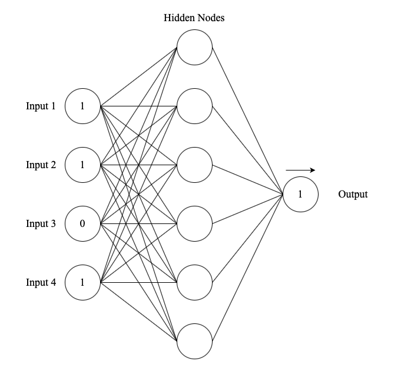

# Neural Network 
Feed forward neural network using backpropagation in Java.
This network is trained to detect parity bits in a set of 4 bit strings.

#### Parity Bit
``
"A parity bit is an extra bit included in binary message to make total number of 1's either odd or even.
For example, to check a binary sequence with even parity, the total number of ones can be counted. If the number of ones is not even, an error is likely to have occurred."
``


### Parameters
```java
//params to play around with 
double learningRate;
int numOfEpochs;
int numOfHiddenNodes; 
```


### Example View
Single layer network with four inputs to represent each bit for our 4 bit string
and one output that represents the expected parity bit. 


```
* parity bit example *

1101 (odd) = 1 
1111 (even) = 0 
```



### Output
Example output for a single layer network with 8 hidden nodes.
```
----------[OUTPUT]----------

Learning rate: 0.3| Number of epochs: 10000| Number of hidden nodes: 8

Training Example: [0.0, 0.0, 0.0, 0.0]| Expected: [1.0]| MSE: 1.6192522177963517E-7| Output: [0.9994310135872745]
Training Example: [0.0, 0.0, 0.0, 1.0]| Expected: [0.0]| MSE: 1.3502502391730324E-4| Output: [0.01643194082761185]
Training Example: [0.0, 0.0, 1.0, 0.0]| Expected: [0.0]| MSE: 9.871926890705472E-5| Output: [0.014053011745265678]
Training Example: [0.0, 0.0, 1.0, 1.0]| Expected: [1.0]| MSE: 1.0681628944363982E-4| Output: [0.9853925297960386]
Training Example: [0.0, 1.0, 0.0, 0.0]| Expected: [0.0]| MSE: 3.325789353622712E-5| Output: [0.00815625109211716]
Training Example: [0.0, 1.0, 0.0, 1.0]| Expected: [1.0]| MSE: 9.034830155284529E-5| Output: [0.986566111817711]
Training Example: [0.0, 1.0, 1.0, 0.0]| Expected: [1.0]| MSE: 1.4651055811892438E-8| Output: [0.9998288318051397]
Training Example: [0.0, 1.0, 1.0, 1.0]| Expected: [0.0]| MSE: 1.2253671760984025E-5| Output: [0.004950426707696106]
Training Example: [1.0, 0.0, 0.0, 0.0]| Expected: [0.0]| MSE: 5.964070419801273E-6| Output: [0.0034529497537433684]
Training Example: [1.0, 0.0, 0.0, 1.0]| Expected: [1.0]| MSE: 2.64200027764916E-4| Output: [0.9770142144541787]
Training Example: [1.0, 0.0, 1.0, 0.0]| Expected: [1.0]| MSE: 4.743320746833728E-4| Output: [0.9691990428998897]
Training Example: [1.0, 0.0, 1.0, 1.0]| Expected: [0.0]| MSE: 9.124439981724708E-4| Output: [0.04268015547265184]
Training Example: [1.0, 1.0, 0.0, 0.0]| Expected: [1.0]| MSE: 1.0056868938391344E-5| Output: [0.9955149708530711]
Training Example: [1.0, 1.0, 0.0, 1.0]| Expected: [0.0]| MSE: 6.075926926361776E-5| Output: [0.011017976512993573]
Training Example: [1.0, 1.0, 1.0, 0.0]| Expected: [0.0]| MSE: 2.2649364455795536E-5| Output: [0.006729940713774166]
Training Example: [1.0, 1.0, 1.0, 1.0]| Expected: [1.0]| MSE: 1.7430312209036617E-4| Output: [0.9813385062303336]
```
